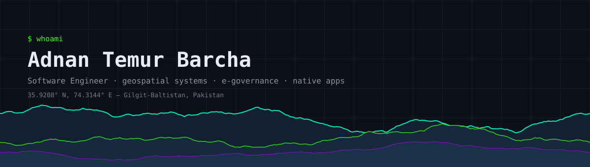

<div align="center">

<picture>
  <source media="(prefers-color-scheme: dark)" srcset="./assets/banner-dark.svg" />
  <source media="(prefers-color-scheme: light)" srcset="./assets/banner-light.svg" />
  
</picture>

<a href="https://git.io/typing-svg"></a>

[](https://adnantemurbarcha.nexylius.com)
[](https://www.linkedin.com/in/adnantemurbarcha/)
[](https://github.com/AdnanTemurBarcha)
[](https://nexylius.com)

</div>

---

### `> whoami`

```js
const adnan = {
    location:  "Gilgit-Baltistan, Pakistan 🏔️",
    role:      "Software Engineer @ Karakoram International University",
    cofounder: { company: "Astraj Pvt. Ltd.", since: 2025, registered: ["SECP", "PSEB"] },
    building: {
        work:    ["e-governance & budget automation", "GIS / biodiversity platforms"],
        product: "browser extensions, desktop apps and web tools under Nexylius"
    },
    exploring:  "cross-platform media pipelines with C++17 / Qt 6 / FFmpeg",
    philosophy: "Ship pragmatic solutions. Skip the ceremony."
};
```

---

### 🔹 Products

Everything below is live and in use — not a demo folder.

| | What it does | Links |
|---|---|---|
| **Snipwise** | Screenshot, annotate and export straight to PDF, in the browser | [site](https://snipwise.nexylius.com) · [store](https://chromewebstore.google.com/detail/snipwise-screenshot-pdf/noaambcmjanlemlfmpokannnhcjofclm) · [repo](https://github.com/AdnanTemurBarcha/snipwise) |
| **SwiftCheck** | Connection speed test that runs as a Chrome extension | [site](https://swiftcheck.nexylius.com) · [store](https://chromewebstore.google.com/detail/swiftcheck-%E2%80%94-speed-test/aljdoacllmnpjfkmakabieikmekjpfnd) · [repo](https://github.com/AdnanTemurBarcha/swift-check) |
| **PostSnap** | Turns screenshots into clean, shareable posts | [site](https://postsnap.nexylius.com) · [store](https://chromewebstore.google.com/detail/postsnap-beautiful-screen/oablkgadbenbflpbnojhkkjlpmpofpoa) · [repo](https://github.com/AdnanTemurBarcha/postsnap) |
| **PasaFile** | Peer-to-peer file transfer over WebRTC — the bytes never touch a server | [site](https://pasafile.nexylius.com) |
| **EqualStream** | Browser audio streaming with live equalisation and visualisation | [site](https://equalstream.nexylius.com) |
| **ImagiForge** | Free AI image generation on Stable Diffusion XL, desktop and mobile | [site](https://imag.nexylius.com) · [desktop](https://github.com/AdnanTemurBarcha/imagiforge-desktop) · [mobile](https://github.com/AdnanTemurBarcha/imagiforge-mobile) |
| **NexPlayer** | Cross-platform media player in C++17 / Qt 6 / QML with FFmpeg | [repo](https://github.com/AdnanTemurBarcha/nexplayer-v1) |
| **LocalMind** | Desktop AI assistant — no subscription, no API key | [repo](https://github.com/AdnanTemurBarcha/localmind) |
| **Grambot** | Instagram automation built on Python and Playwright | [repo](https://github.com/AdnanTemurBarcha/grambot) |

---

### 🔹 Professional Work

| Project | Domain |
|---|---|
| **iPADS** | Public-sector budgeting and ADP planning — workflow automation, financial validation, real-time notifications. Deployed inside government; source not public. |
| **HRE Biodiversity Portal** | GIS platform for biodiversity and environmental data, on PostGIS + GeoServer with OpenLayers rendering. |
| **GBTS** | Online examination platform with secure assessment workflows and Safe Exam Browser integration. |

---

### 🔹 Tech Arsenal

<div align="center">

**Backend & Core**


**Frontend & Mobile**


**GIS & Data**


**Infra & Media**


</div>

---

### 🔹 Activity

<div align="center">

<picture>
  <source media="(prefers-color-scheme: dark)" srcset="https://raw.githubusercontent.com/AdnanTemurBarcha/adnantemurbarcha/output/contributions-dark.svg" />
  <source media="(prefers-color-scheme: light)" srcset="https://raw.githubusercontent.com/AdnanTemurBarcha/adnantemurbarcha/output/contributions-light.svg" />
  
</picture>

<picture>
  <source media="(prefers-color-scheme: dark)" srcset="https://raw.githubusercontent.com/AdnanTemurBarcha/adnantemurbarcha/output/github-snake-dark.svg" />
  <source media="(prefers-color-scheme: light)" srcset="https://raw.githubusercontent.com/AdnanTemurBarcha/adnantemurbarcha/output/github-snake.svg" />
  
</picture>

</div>

---

### 🔹 Beyond Code

<div align="center">

🎬 Video Editing · 🎵 Music Production · 🗺️ GIS & Mapping · 🏔️ Karakoram

</div>

<div align="center">


<p><code>// pragmatic code beats perfect architecture</code></p>

</div>
